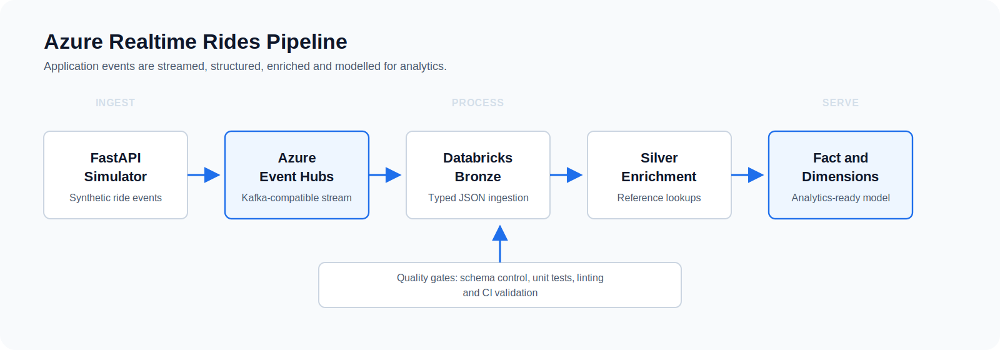

# Azure Realtime Rides Pipeline

Portfolio project by Jayalakshmi Kumar.

## Scope

This project demonstrates a realtime data engineering pattern for ride-booking events:

1. A FastAPI simulator generates synthetic ride events.
2. Events are published to Azure Event Hubs.
3. Databricks reads the stream through the Kafka endpoint.
4. PySpark parses JSON events into a structured bronze/staging table.
5. SQL enriches the ride stream with reference data.
6. Databricks creates fact and dimension tables for analytics.

The project is intentionally focused on the data engineering flow. It does not deploy production Azure resources automatically.

## Architecture



## Repository Structure

```text
src/realtime_rides/     FastAPI app, event generator, Event Hubs publisher
databricks/             Databricks pipeline scripts and SQL transformations
data/reference/         Lookup data used for enrichment
data/sample/            Sample bulk ride events
templates/              Minimal simulator UI
tests/                  Unit tests for event generation
.github/workflows/      Python CI pipeline
```

## Key Technical Decisions

- Uses environment variables for Event Hubs credentials so secrets are not committed.
- Separates event generation from Event Hubs publishing for easier testing.
- Uses typed JSON parsing in Databricks to control schema drift.
- Models analytical outputs as fact and dimension tables rather than leaving data as raw events.
- Adds GitHub Actions for linting and unit tests.

## Local Setup

```bash
python -m venv .venv
source .venv/bin/activate
python -m pip install -e ".[dev]"
cp .env.example .env
pytest
```

To run the simulator after setting Event Hubs credentials:

```bash
uvicorn realtime_rides.app:app --reload
```

## Project Outcomes

- Built a realtime pattern for ride-booking events that moves data from an application event into Azure Event Hubs and Databricks.
- Converted semi-structured JSON events into typed streaming tables so downstream transformations have a stable schema.
- Enriched ride facts with reference data for vehicle, payment, status, city and cancellation context.
- Modelled curated outputs as fact and dimension tables so the data is ready for analytical reporting.
- Added automated linting and tests through GitHub Actions to show basic engineering quality gates.
